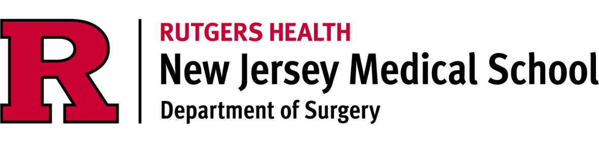
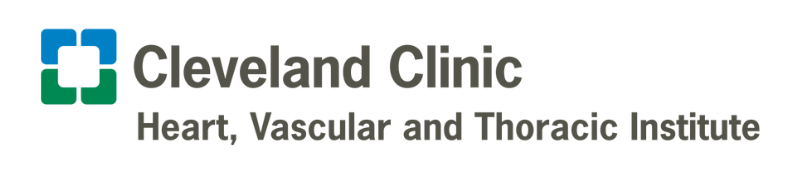

## Education & Experience

I graduated from Boston College with a degree in Bachelor of Science in Biochemistry. I then took a gap year to work as a medical scribe in Brigham and Women's Primary Care Practice before starting medical school at University of Connecticut School of Medicine. After earning my doctorate degree in medicine, I became a general surgery resident at Rutgers NJMS in New Jersey. Currently, as part of my residency training, I am in my dedicated research year, working with the cardiothoracic team at Cleveland Clinic.

----

## Past & Current Projects

I have been involved in various research experiences since I was an undergraduate at Boston College. The work there primarily consisted of benchwork research, studying the epigenetic changes that occur in yeast cells. Then, during my medical education and training, I have shifted my focus to clinical research looking at ways to improve the process for diagnosing and treating various medical conditions. The topics ranged from classifying the different types of Bertolotti syndrome which is a congenital disorder leading to fusion of the lower part of the spine to surgical management of tracheobronchomalacia which results in excessive narrowing of the upper airway. Currently, my work with the Cleveland Clinic Heart, Vascular & Thoracic Institute spans across many different cardiac and thoracic diseases. Of these various projects, my primary focus is on analyzing the outcomes after surgery for benign esophageal dysmotility disorders and to determine the patient-related and procedure-related factors that contribute to short- and long-term complications after surgery.
