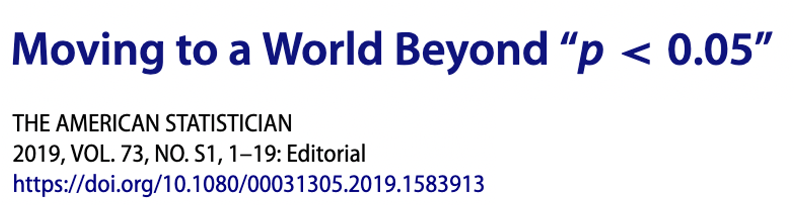

## *p* < 0.05



This article discusses the importance of understanding research beyond the simple classification of scientific results as either statistically significant or not statistically significant. In the current era, the statement of "p < 0.05" has become the equivalent of scientific importance and worth in the literature, despite the fact that the p-value does not hold that meaning. The article explains that this cut off is meant to signify to a researcher that a particular result warrants further scrutiny and does not tell us the level of importance of an association or effect. By acknowledging this limitation of the p-value, we can then move beyond it. The article teaches us instead to remember "**ATOM**" - "**A**ccept uncertainty. Be **T**houghtful, **O**pen, and **M**odest." I agree that conducting sound scientific research starts with being thoughtful and being deliberate. We need to put our energy into carefully designing and planning out a study, rather than simply wanting to produce results that will be "statistically significant." The expected outcomes should be thought of before the study to consider what a meaningful effect size would be. In addition, the relevance of any results obtained will then need to be explained based on whether the results have any practical benefits to the larger scientific community, rather than simply classifying them as statistically significant or not. I do admit that I had been blinded to this notion of "statistical significance" that is still widespread in the medical literature. Therefore, this article helped me to think more broadly and more thoroughly into the research questions I've been working on. The link to this article is below for anyone who wants to learn further.

```{=html}
<div  style="margin: 30px; text-align: center;">
<a class="btn btn-primary" href="https://amstat.tandfonline.com/doi/epdf/10.1080/00031305.2019.1583913" role="button" target="_blank" style="padding: 15px 30px;">Click to open article</a>
</div>
```
